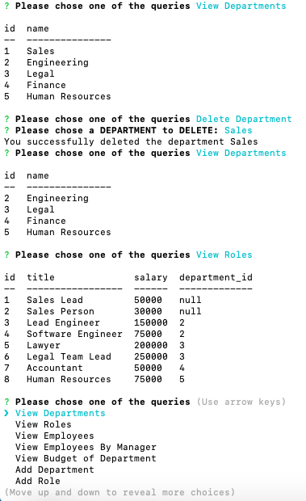

# Employee Management System

## About: ##

* This is an application for managing a company's employees using node, inquirer and MySQL. It is a command line application that allows users to:

  - Add departments, roles and employees
  - View departments, roles and employees
  - Update employee roles
  - Update employee managers
  - View employees by manager
  - Delete departments, roles, and employees
  - View the total utilized budget of a department -- ie the combined salaries of all employees in that department


## Installation: ##

  * run npm install to install the dependencies since package.json is included.

  * The application has the following files.

    - `schema.sql` : This contains schema of the database employee_managementDB. It includes SQL to create a database, create `employee`, `role` and `department` tables.

    - `seed.sql`: This is to pre-populate our database. It includes SQL to insert data into `employee`, `role` and `department` tables.
    - `server.js`: Our main program which connects to the database and responds to user's query inputs.
    
  * Enter `npm start` to run the application


## Dependencies: ##

    The application depends on the following packages:

  * console.table: This NPM package is used to print MySQL rows to the console.
  * inquirer: This NPM package is used to interact with the user via the command-line.
  * mysql: This NPM package is used to  connect to our MySQL database and perform queries
   

## Usage: ##

  [Animated Gif](https://drive.google.com/file/d/19g_g-GXjvDCDQgLcPIMvWiLMgmy5ed9k/view)

   - After running "npm install" and running `schema.sql` and `seed.sql` from the MySQL Workbench, when the user runs `npm start`, he sees a list of query options to choose from and when he chooses, `View Departments`, he will see the list of available departments

     
     ---
   - When user chooses `View Roles`, he will see all the roles, salaries for those roles and department ID's they are related with.

     

     --------------------------------------------------------------

   - When user chooses `View Employees`, he will see a list of employees with their ID's, names, role_id  and manager_id properties.

     

     ---------------------------------------------------------------

   - `View Employees By Manager` menu option lists existing managers, in our example we have 3 managers. When the user chooses Lead Engineer William Shakespeare, he will see the employees working under him. In this case it is the Software Engineer Emily Dickinson.


     


    -----------------------------------------------------------------
   - When `View Budget of Department` is chosen, the user prompted to click one of the departments to see the utilized budget which is the sum of the salaries of employees working in that department. In our example, when we chose enegineering department, we see the budget which is 225000 that makes sense because in this department works a Lead Engineer with salary of 150000 and a software engineer with a salary of 75000 . The total of those employee's salaries sums up to 225000.

   

   - When `Add Department` option is chosen, the user prompted to the name of the department. After user enters that, ID is assigned automatically. In our example , we added `human resources department`.

   

   - When `Add Role` option is chosen,the user prompted about the title, salary of the role and list of departments is given for user to choose of which the role is associated with. In our example, we define a `HR Manager position` with salary of 75000 and associate tht with the HR department

   

   - When `Add Employee` option is chosen,the user will be  prompted about the first name, and last name and the user will see a list of roles which he will choose for the employee (The corresponding role id will be added to the database). He will choose a manager if there is one or chose `none` and again id corresponding to the manager name or null will be added to the database. User will see a message about employee being created.

   

   - User can update the employee role by choosing `Update Employee Role`, chooses among employees to update; for our example let's chose our last added employee, change her position from "Software Engineer" to "Lead Engineer". As we can see, she will probably have no manager we have to update her manager and change the manager_id to null at next step.

   

   - We are going to change the manager_id to null for our last added employee by choosing "Update Employee Manager"

   

   - By choosing `Delete Department`, user can delete an apartment. He will be able to choose from available departments. When the department is deleted, the roles associated with it are not deleted but at the `role` table `role_id` becomes null. The reason for that, when department is deleted, the roles may be associated with another department later. Let's delete the `Sales` department.

   

   - Now we are going to delete roles related to `Sales` (Sales Lead and Sales Person) by chosing "Delete Role". When the roles are deleted the employees that have that roles will be deleted from the `employee` table automatically due to defined `foreign keys` in the schema of the database. Here we can see that `Tom Clancy` and `Dan Brown` are removed from the `employee` table. Since the roles `Sales Lead` and `Sales Person` are deleted from the `role` table. 

   

   - By choosing `Delete Employee`, we can delete an employee from `Employee` table. Let's delete our software engineer `Emily Dickinson` from the employee list. 

   


---------------------------------------------------------------------------------------------------------------------------

## How: ##

* Following database schema is designed containing three tables:


* department:

  - id, INT PRIMARY KEY
  - name, VARCHAR(30) to hold department name

* role:

  - id, INT PRIMARY KEY
  - title, VARCHAR(30) to hold role title
  - salary, DECIMAL to hold role salary
  - department_id, INT to hold reference to department role belongs to

* employee:

  - id, INT PRIMARY KEY
  - first_name - VARCHAR(30) to hold employee first name
  - last_name - VARCHAR(30) to hold employee last name
  - role_id - INT to hold reference to role employee has
  - manager_id - INT to hold reference to another employee that manager of the current employee. This field may be null if the employee has no manager

 * schema.sql:
 ```
 DROP DATABASE IF EXISTS employee_managementDB;
CREATE DATABASE employee_managementDB;
USE employee_managementDB;

CREATE TABLE department(
id INT AUTO_INCREMENT NOT NULL,
name VARCHAR(30) NOT NULL,
PRIMARY KEY (id)
);

CREATE TABLE role(
 id INT AUTO_INCREMENT NOT NULL,
 title VARCHAR(30) NOT NULL,
 salary DECIMAL(10,2) NOT NULL,
 department_id INT  NULL,
 CONSTRAINT fk_category2
    FOREIGN KEY (department_id) 
    REFERENCES department(id)
        ON UPDATE CASCADE
        ON DELETE SET NULL,
 PRIMARY KEY (id)
); 


CREATE TABLE employee(
  id INT AUTO_INCREMENT NOT NULL,
  first_name VARCHAR(30) NOT NULL,
  last_name VARCHAR(30) NOT NULL,
  role_id INT NULL,
  manager_id INT NULL,
  CONSTRAINT fk_category1
    FOREIGN KEY (role_id) 
    REFERENCES role(id)
        ON UPDATE CASCADE
        ON DELETE CASCADE,
	FOREIGN KEY (manager_id) 
    REFERENCES employee(id)
        ON UPDATE CASCADE
        ON DELETE SET NULL,
  PRIMARY KEY (id)
);
 ```
 * seed.sql
 ```
 USE employee_managementDB;

INSERT INTO department (name) VALUES("Sales");
INSERT INTO department (name) VALUES("Engineering");
INSERT INTO department (name) VALUES("Legal");
INSERT INTO department (name) VALUES("Finance");

INSERT INTO role (title,salary,department_id) 
VALUES("Sales Lead",50000,1);
INSERT INTO role (title,salary,department_id) 
VALUES("Sales Person",30000,1);
INSERT INTO role (title,salary,department_id) 
VALUES("Lead Engineer",150000,2);
INSERT INTO role (title,salary,department_id) 
VALUES("Software Engineer",75000,2);
INSERT INTO role (title,salary,department_id) 
VALUES("Lawyer",200000,3);
INSERT INTO role (title,salary,department_id) 
VALUES("Legal Team Lead",250000,3);
INSERT INTO role (title,salary,department_id) 
VALUES("Accountant",50000,4);

INSERT INTO employee (first_name,last_name,role_id,manager_id) 
VALUES("Tom","Clancy",1,null);
INSERT INTO employee (first_name,last_name,role_id,manager_id) 
VALUES("Dan","Brown",2,1);
INSERT INTO employee (first_name,last_name,role_id,manager_id) 
VALUES("William","Shakespeare",3,null);
INSERT INTO employee (first_name,last_name,role_id,manager_id) 
VALUES("Emily","Dickinson",4,3);
INSERT INTO employee (first_name,last_name,role_id,manager_id) 
VALUES("Arthur Conan","Doyle",6,null);
INSERT INTO employee (first_name,last_name,role_id,manager_id) 
VALUES("Leo","Tolstoy",5,5);
INSERT INTO employee (first_name,last_name,role_id,manager_id) 
VALUES("Edgar Allen","Poe",7,null);

SELECT * FROM department;
SELECT * FROM role;
SELECT * FROM employee;

 ```

## Credits: ## 

I'm greatful for our instructor Omar Patel and TA's Tyler Bray, Matthew Calimbas for their help on the issues encountered in the process of developing this application.

The web sites that I found useful while implementing the application are listed below:

  * https://www.npmjs.com/package/console.table
  * https://www.w3schools.com/sql/func_mysql_sum.asp
  * https://developer.mozilla.org/en-US/docs/Web/JavaScript/Reference/Operators/await
  * http://www.mysqltutorial.org/mysql-foreign-key/
  
## Licence: ##

Anybody is welcomed to copy code snippets and test it out.
